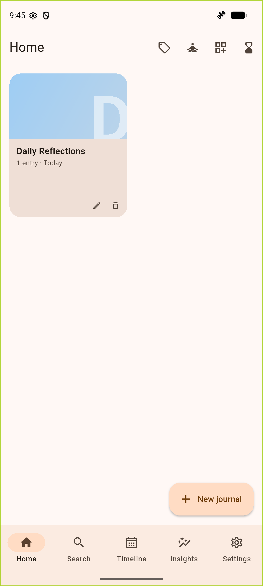
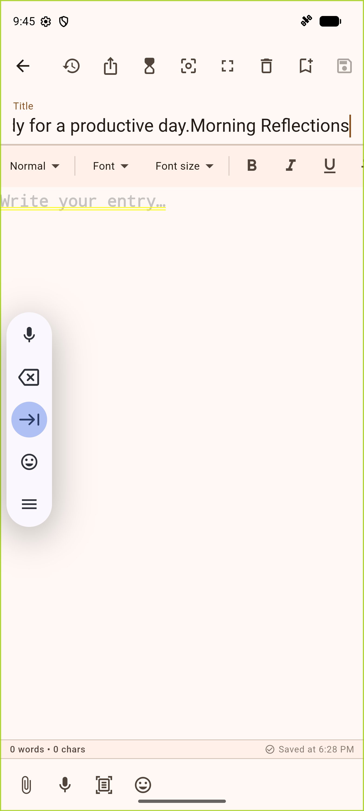
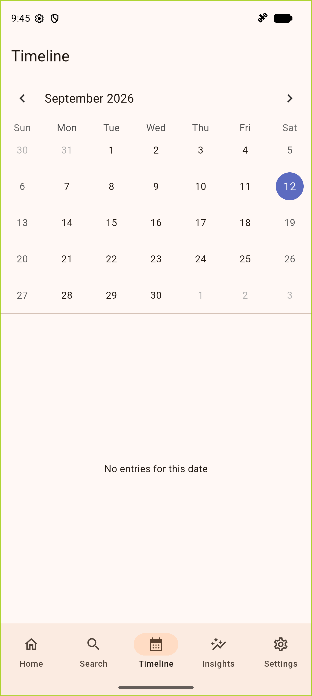
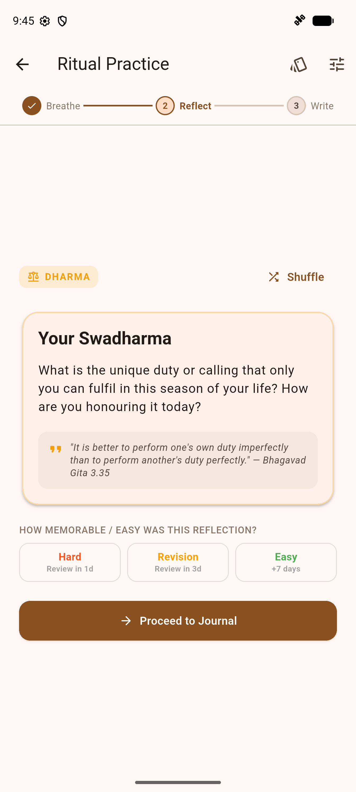
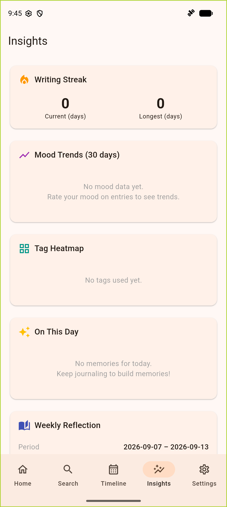
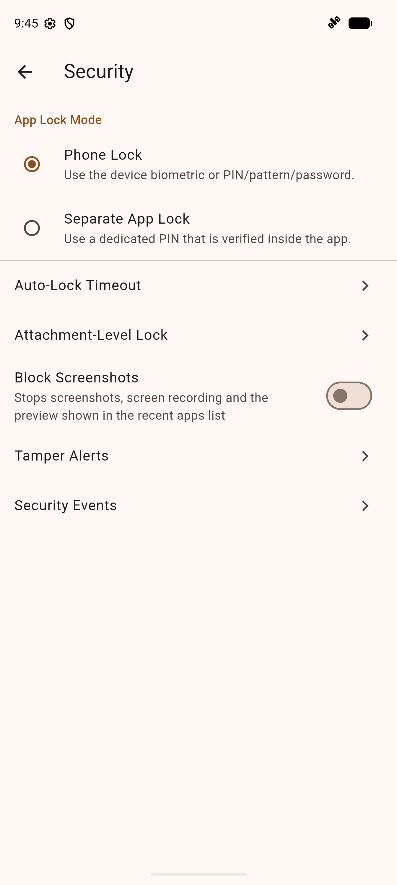
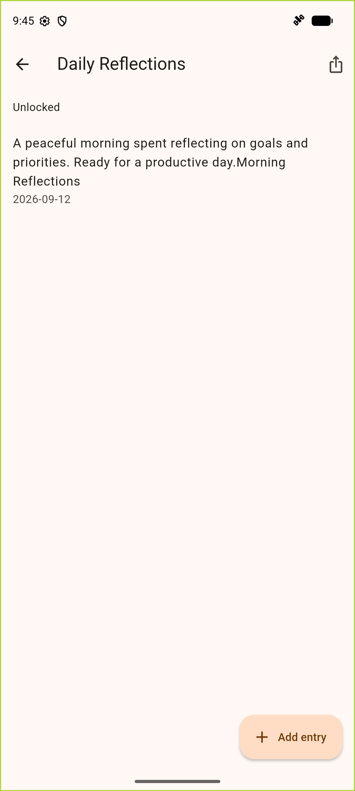
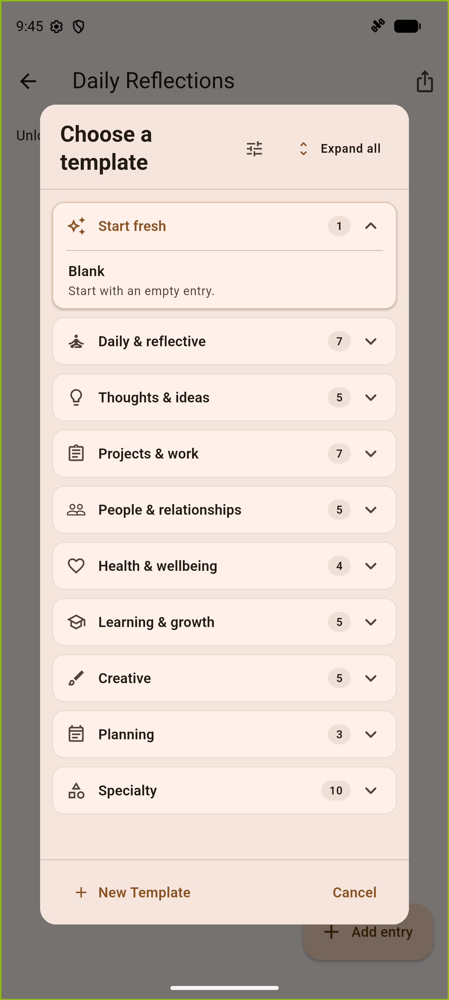
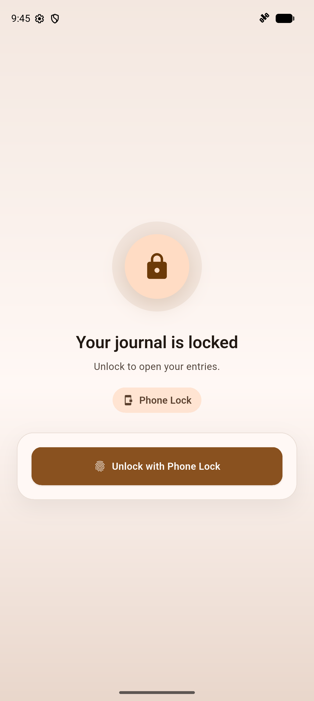

# SreerajP Journal Vault

A production-grade, security-hardened, privacy-first offline personal journal, diary, and knowledge vault built with Flutter for Android.

[-green.svg)](docs/architecture.md)
[](pubspec.yaml)
[](docs/security.md)
[](docs/security.md)
[](LICENSE)

---

## Overview

**SreerajP Journal Vault** is designed for anyone who wants a rich, beautiful, and completely private space to write, think, reflect, and organize knowledge. 

Your thoughts, feelings, voice notes, photos, and files are yours alone. SreerajP Journal Vault is governed by three strict engineering profiles: **Core Baseline**, **Production App Extension**, and **Sensitive Data Extension**. It has **no cloud dependencies, no analytics, no third-party trackers, and no network requirements**.

Everything is encrypted on your device and remains under your complete control.

---

## Key Highlights

- 🔒 **100% Offline & Zero Telemetry**: Operates without cloud accounts or remote servers. No network tracking, no crash telemetry, and no ad SDKs.
- 🛡️ **End-to-End Vault Encryption**: The entire database is encrypted at rest using **SQLCipher** with a key stored in the **Android Keystore**. Attachments are encrypted with **AES-256-GCM**.
- 🪟 **Screen Protection (`FLAG_SECURE`)**: Prevents screenshots, screen recording, and system task-switcher preview snapshots across all views.
- ✍️ **Rich Text & Interactive Embeds**: Powered by Flutter Quill with custom inline embeds: formatted tables, callout admonitions, inline images, voice recordings with live speech-to-text, and vector drawing canvas blocks.
- 📷 **On-Device OCR Text Scanner**: Extract text from documents and book pages directly into entries using on-device OCR for both English and Malayalam, with built-in crop and rotation tools.
- 🧠 **Interconnected Knowledge**: Wiki-style backlinks (`[[Entry Title]]`), smart tags with auto/custom colors, reusable entry templates with dynamic date tokens, and full-text search indexing both entries and attachments.
- 📊 **Timeline, Calendar & Insights**: Interactive 30-day mood trends, writing streaks, word counts, tag heatmaps, and "On This Day" memory resurfacing.
- 🧘 **Daily Journaling Ritual & Philosophy Decks**: Guided contemplation timer, 3D card-flip reveal, curated Sanathana Dharma thought cards in three languages, and custom prompt decks.
- 🔄 **Air-Gapped & Local Sync**: Direct device-to-device local Wi-Fi sync (E2EE with ephemeral X25519 and AES-256-GCM) and 100% optical AirQR sync using animated QR streams.
- 📦 **Data Freedom & Multi-Format Export**: Export single entries or whole journals to Markdown, HTML, Plain Text, or standalone offline PDF (with full Malayalam font shaping). Password-protect exports with encrypted `.jvenc` containers.
- 🎨 **Aesthetic Reading Surfaces & Trilingual Polish**: Curated Light, Paper/Sepia, Dark, and OLED True Black surfaces, typography customization, and full English, Malayalam and Sanskrit localization, switchable in Settings without a restart.

---

## App Showcase

<div align="center">

| Home & Journals | Rich Text Editor | Timeline & Calendar |
| :---: | :---: | :---: |
|  |  |  |

| Mindful Rituals | Insights & Analytics | Hardware Security |
| :---: | :---: | :---: |
|  |  |  |

| Journal Entries | Categorized Templates | Vault Lock Gate |
| :---: | :---: | :---: |
|  |  |  |

</div>

---

## Feature Tour

### 1. Security & Privacy Architecture
- **SQLCipher Database Encryption**: All journal metadata, entry content, tags, revisions, moods, and search indexes are encrypted at rest with hardware Keystore-backed keys.
- **Hardware-Wrapped Attachment Encryption**: Media attachments (images, PDFs, audio recordings, documents, and drawings) are encrypted on disk with AES-256-GCM. Keys are managed through the native Android Keystore.
- **Flexible App Lock Modes**: Choose between Android Device Credentials (Biometrics, Fingerprint, Face, System PIN/Pattern) or a dedicated 6-digit Keystore-hashed App PIN.
- **Per-Journal Password Locks**: Lock individual sensitive journals with dedicated passphrases using Argon2id/PBKDF2 key derivation.
- **Fine-Grained Attachment Locks**: Require re-authentication before decrypting or exporting specific confidential files.
- **Auto-Lock Profiles**: Immediate lock on minimize or backgrounding, configurable inactivity timeouts, and cron-based scheduled locking.
- **Security Audit & Tamper Alerts**: Real-time audit logs of security events and a dedicated vault integrity verification screen.

### 2. Rich Text & Multimedia Journaling
- **Full-Featured Rich Text Editor**: Headings (H1, H2, H3), bold, italics, underline, strikethrough, blockquotes, bulleted and numbered lists, code blocks, font colors, and text alignment.
- **Custom Quill Embeds**:
  - **Tables**: Insert and edit interactive grid tables directly within prose.
  - **Callout Boxes**: Highlight notes, tips, warnings, and thoughts with custom accent styles.
  - **Handwriting & Drawing Canvas**: Sketch diagrams or write notes by hand with pen, highlighter, eraser, multi-color palette, stroke widths, and paper styles (blank, ruled, grid, dot).
  - **Inline Images**: Encrypted images embedded directly within the text with sizing presets.
  - **Voice Notes**: In-editor voice recordings with playback controls and live speech-to-text transcription.
- **Quality-of-Life Tools**: Live word and character stats, instant Markdown typing shortcuts (e.g. `# `, `- `, `[] `), distraction-free full-screen mode, and paragraph focus dimming.
- **Version History**: Snapshot restoration and revision diffing for all edited entries.

### 3. Knowledge Management & Search
- **Wiki-Style Backlinks**: Link entries together using `[[Entry Title]]` syntax with an interactive "Linked From" discovery panel at the bottom of each entry.
- **SQLite FTS5 Full-Text Search**: Instant search over journal titles, entry prose, and extracted attachment text (`.txt`, `.pdf`, `.md`, `.csv`).
- **Smart Tags**: Categorize journals and entries with color-coded tags, tag suggestions, and a dedicated Tag Manager.
- **Customizable Templates**: Pre-built templates (Daily Journal, Gratitude, Travel Log, Meeting Notes, Habit Tracker) or custom user templates with dynamic date tokens (`{{today}}`, `{{weekday}}`, `{{date}}`, `{{time}}`).

### 4. Timeline, Calendar & Insights
- **Chronological Timeline**: Scroll through your memories grouped by month with quick navigation jumps.
- **Calendar Heatmap**: View daily writing activity and mood distribution on a monthly calendar grid.
- **Dynamic Analytics**: Track writing streaks, cumulative word counts, 30-day sentiment and mood trend charts (1-5 scale), and tag usage heatmaps.
- **"On This Day" Memories**: Resurface and reflect upon entries written on this exact day in previous years.
- **Weekly Reflections**: Automated weekly summaries of words written, entries created, and average mood.

### 5. Mindful Rituals & Philosophy Cards
- **Daily Journaling Ritual**: A mindful routine featuring calming atmosphere visuals, a contemplation timer, and an interactive 3D card-flip reveal.
- **Sanathana Dharma Thought Decks**: Inspiring prompt decks drawing from timeless philosophy, Vedic wisdom, the Bhagavad Gita, and universal ethics, fully localized in English, Malayalam and Sanskrit.
- **Custom Ritual Decks**: Compose your own prompt decks with custom introspective questions, descriptions, and accent colors.
- **Time Capsules**: Seal entries into future-dated time capsules with countdown timers and local unlock notifications.

### 6. Offline Sync, Data Portability & Backups
- **Direct P2P Wi-Fi Sync**: Sync securely between two devices over the local network with zero cloud servers. Uses ephemeral X25519 key exchange and AES-256-GCM encryption with built-in conflict resolution.
- **Optical AirQR Sync**: 100% air-gapped data transfer using animated QR code streams, with zero radio emissions.
- **Multi-Format Export**: Export entries or entire journals to Markdown, HTML, Plain Text, or PDF. PDF generation embeds offline fonts for flawless Malayalam text shaping.
- **Password-Sealed Exports**: Optional AES-256-GCM encryption under an Argon2id key (`.jvenc`) for secure file transport.
- **Automated Encrypted Backups**: Scheduled backup archives (`.jvbk`) with integrity checks, pre-restore previews, dry-run simulations, and atomic restore.
- **Storage Location Migration**: Seamlessly move encrypted attachment data between App-Private Storage and External SD Cards via the Android Storage Access Framework (SAF).

### 7. Appearance & In-App Viewers
- **Reading Surfaces**: Choose from Light, Paper/Sepia (`#F8F3E6`), Dark, and OLED True Black (`#000000`) surfaces.
- **Personalized Accents & Typography**: Select custom accent palettes and customize body fonts (Modern Sans, Literary Serif, Typewriter Monospace) and font sizes.
- **Built-in Secure Viewers**: Embedded PDF reader, audio player with waveform visualization, and ZIP archive browser. Decrypted temporary files are cleaned up automatically upon exit.
- **Trilingual Interface**: English, Malayalam (`മലയാളം`) and Sanskrit (`संस्कृतम्`), chosen in Settings and applied at once.

---

## Technical Architecture

```text
lib/
|-- app/          # App shell, routing, navigation bar, settings hub
|-- core/         # Cross-cutting: database, crypto, logging, theme, utils
|-- features/     # 16 modular feature packages:
|   |-- about/           # Config-driven about metadata
|   |-- attachments/     # Media encryption, storage SAF, secure viewers
|   |-- backup/          # Scheduled encrypted backups & restore engine
|   |-- entries/         # Quill editor, custom embeds, revisions, OCR
|   |-- export/          # Markdown, HTML, Plain text, and offline PDF export
|   |-- import/          # Markdown, DOCX, and text import adapters
|   |-- insights/        # Word streaks, mood charts, memories
|   |-- journal_lock/    # Granular per-journal password encryption
|   |-- lock_gate/       # Device biometric and App PIN lock gates
|   |-- permissions/     # Runtime permissions transparency center
|   |-- search/          # SQLite FTS5 full-text search & presets
|   |-- security/        # Tamper alerts, security audit event logging
|   |-- smart_tags/      # Tag chip bar & live auto-suggestions
|   |-- sync/            # Local P2P Wi-Fi Sync & Optical AirQR sync
|   |-- tags/            # Tag management & color derivation
|   `-- timeline/        # Timeline feed & monthly calendar heatmaps
|-- l10n/         # Localization ARB files (English, Malayalam & Sanskrit)
`-- main.dart     # Composition root & provider overrides
```

| Layer | Technology | Details |
|---|---|---|
| **Framework** | Flutter 3.44.8 / Dart 3.12.2 | Android only (minSdk 28, compileSdk/targetSdk 36) |
| **State Management** | Riverpod 2.x | Explicit dependency injection with zero build-runner for providers |
| **Database** | Drift + SQLCipher | Full database-at-rest encryption via native `sqlite3` build hooks |
| **Search Engine** | SQLite FTS5 | Indexed search over entries and attachment text extracts |
| **Key Storage** | Android Keystore | Native method channels for wrap/unwrap and key management |
| **Editor** | Flutter Quill | Custom embeds for tables, callouts, drawings, voice notes, images |
| **OCR** | Google ML Kit + Tesseract | Offline on-device text recognition (English & Malayalam) |
| **Sync Protocols** | Local Wi-Fi (X25519/AES-GCM) & AirQR | Offline peer-to-peer and air-gapped optical transport |

---

## Getting Started (Developers)

### Prerequisites

| Tool | Version |
|---|---|
| Flutter | 3.44.8 (stable) |
| Dart | 3.12.2 |
| JDK | 17 |
| Android SDK | compileSdk / targetSdk 36, **minSdk 28** |
| Gradle | 8.14 (via wrapper) |
| Android Gradle Plugin | 8.11.1 |
| Kotlin | 2.2.20 |

> **Note:** Android is the only supported target. iOS, Web, Windows, Linux, and macOS directories are Flutter scaffolding and are not supported.

### Setup from a Clean Clone

```sh
git submodule update --init --recursive
git config core.hooksPath .githooks
flutter pub get
dart run build_runner build --delete-conflicting-outputs
flutter run --flavor dev
```

1. **`git submodule update`** initializes `docs/guidelines/` (shared engineering guidelines).
2. **`git config core.hooksPath`** enables pre-commit checks (formatting, analysis, absolute path guards).
3. **`build_runner`** generates database bindings (`app_database.g.dart`).
4. **`--flavor dev`** is required; bare `flutter run` will fail.

### Running the App

```sh
flutter run --flavor dev     # Daily development (debug keystore, verbose logs)
flutter run --flavor prod    # Production flavor (requires release keystore)
```

### Running Tests & Static Checks

```sh
# Run all unit and widget tests
flutter test

# Run a specific feature test
flutter test test/features/entries

# Run with test coverage
flutter test --coverage

# Static analysis and formatting checks (must be clean before commits)
flutter analyze
dart format --set-exit-if-changed lib test integration_test
```

### Code Generation & Migrations

- **Drift Database**: After modifying tables or queries in `lib/core/database/`:
  ```sh
  dart run build_runner build --delete-conflicting-outputs
  ```
- **Localization**: After updating `lib/l10n/app_en.arb` or `lib/l10n/app_ml.arb`:
  ```sh
  flutter gen-l10n
  ```

### Building a Production Release

```sh
flutter build apk --flavor prod --release \
  --obfuscate --split-debug-info=build/symbols/android-prod-<version>/ --split-per-abi
```

Detailed release instructions, keystore setup, and hardening guidelines are in [`docs/release_process.md`](docs/release_process.md).

---

## Documentation Map

| Document | Purpose |
|---|---|
| [`docs/features.md`](docs/features.md) | Comprehensive specification of all implemented features |
| [`docs/architecture.md`](docs/architecture.md) | Architecture, state flow, schema design, and gap tracking |
| [`docs/security.md`](docs/security.md) | Threat model, cryptographic specifications, and OWASP checklist |
| [`docs/release_process.md`](docs/release_process.md) | Keystore setup, hardening, release checklist, and rollback procedures |
| [`docs/project_structure.md`](docs/project_structure.md) | Complete directory layout and component ownership |
| [`docs/dependencies.md`](docs/dependencies.md) | Dependency inventory and blocked library policies |
| [`docs/workflow_rules.md`](docs/workflow_rules.md) | Development workflow rules, planning gates, and privacy policies |
| [`CHANGELOG.md`](CHANGELOG.md) | User-facing release history |

---

## License

This project is licensed under the [MIT License](LICENSE).
